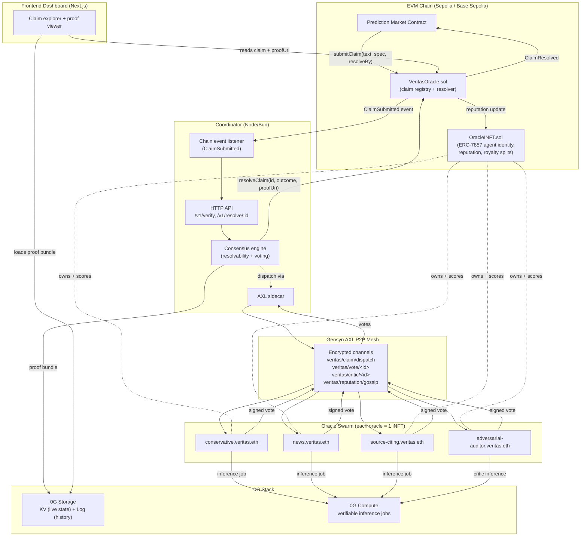
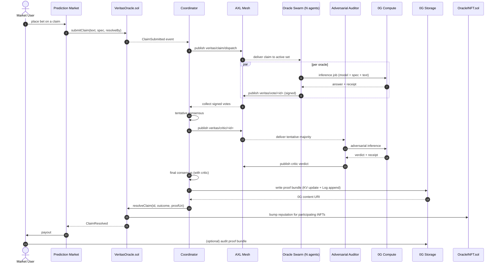
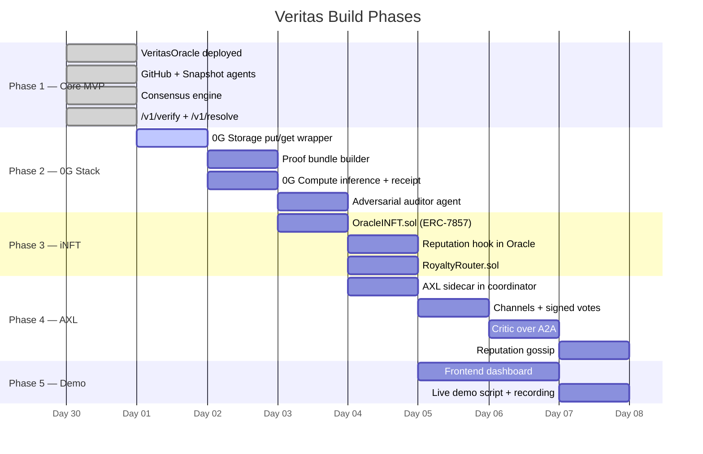

# Veritas — Architecture & Build Plan

A concrete, actionable map of what to build, in what order, and how the pieces connect. Pair this with `README.md` (product story) and `TECHNICAL_GUIDE.md` (current code reference).

---

## 1. What We're Building (One Paragraph)

Veritas is a **swarm of AI oracles** that resolves prediction-market questions. A market submits a claim on-chain; a coordinator dispatches it to multiple independent oracle agents; each agent answers with reasoning, evidence, and confidence; a consensus engine decides `YES / NO / INVALID / ESCALATE`; the result is written back on-chain with a proof bundle URI.

For the hackathon we layer three sponsor stacks on top:

- **0G Storage + 0G Compute** — persistent agent memory and verifiable inference (proof bundles live on 0G).
- **iNFT (ERC-7857)** — every oracle is an iNFT; ownership, reputation, royalties, and upgrades are on-chain; encrypted skill/policy/memory live on 0G Storage.
- **Gensyn AXL** — oracle-to-oracle traffic (claim dispatch, reasoning exchange, signed votes, critic pulls, reputation gossip) flows over an encrypted P2P mesh — no central message bus.

---

## 2. System Architecture



**Key idea:** the coordinator is *logical*, not centralized. Once AXL is wired in, dispatch and votes flow over the mesh — the coordinator's job shrinks to "submit on-chain transaction" and "host the dashboard's read API".

---

## 3. End-to-End User Flow



---

## 4. Component Breakdown

Status legend: **[have]** already in repo • **[extend]** exists but needs upgrade • **[new]** build from scratch

### 4.1 Smart Contracts (`contract/`)

| Contract            | Status   | Responsibility                                                                                  |
| ------------------- | -------- | ----------------------------------------------------------------------------------------------- |
| `VeritasOracle.sol` | [have]   | Claim registry: `submitClaim`, `resolveClaim`, `Claim` struct, events                           |
| `OracleINFT.sol`    | [new]    | ERC-7857 iNFT for each oracle: `tokenId`, `bundleUri`, `version`, `reputation`, `splits[]`      |
| `RoyaltyRouter.sol` | [new]    | Splits per-claim fees to each participating iNFT's `splits[]` table                             |

**Extend `VeritasOracle.sol`** to:
- Take a `participants[]` list on `resolveClaim` (iNFT tokenIds that voted)
- Call `OracleINFT.bumpReputation(tokenId, delta)` for each participant on finalization

### 4.2 Coordinator Backend (`backend/`)

| File                | Status   | Change                                                                                  |
| ------------------- | -------- | --------------------------------------------------------------------------------------- |
| `src/index.ts`      | [extend] | Replace direct HTTP agent calls with AXL publish/subscribe                              |
| `src/coordinator.ts`| [extend] | Add critic step + reputation-weighted voting                                            |
| `src/agents.ts`     | [extend] | Becomes `axl.ts` — wraps `localhost:<axl-port>/axl/{send,subscribe}`                    |
| `src/zg.ts`         | [new]    | `putKv`, `appendLog`, `get` against 0G Storage                                          |
| `src/zgCompute.ts`  | [new]    | Submit inference job + parse receipt                                                    |
| `src/proof.ts`      | [new]    | Build proof bundle (request + responses + receipts + consensus trace) and pin to 0G     |

### 4.3 Oracle Agents (`agents/`)

Each oracle is a small service + an AXL subscription:

| Agent                              | Status   | Strategy                                                |
| ---------------------------------- | -------- | ------------------------------------------------------- |
| `agents/github-agent`              | [have]   | Verifies "PR merged before deadline"                    |
| `agents/snapshot-agent`            | [have]   | Verifies "Snapshot proposal passed"                     |
| `agents/conservative-agent`        | [new]    | LLM oracle, only YES with strong evidence               |
| `agents/news-agent`                | [new]    | Pulls live news (e.g. NewsAPI) + recency-weighted       |
| `agents/source-citing-agent`       | [new]    | Must produce ≥ 2 independent sources or abstains        |
| `agents/adversarial-auditor-agent` | [new]    | Critic; runs second pass on majority answer             |

**All agents share one shape:** subscribe to `veritas/claim/dispatch`, run inference (on 0G Compute), publish to `veritas/vote/<id>` with a signed payload.

### 4.4 0G Integration (`backend/src/zg.ts`, `backend/src/zgCompute.ts`)

**Storage layout (canonical schema):**

KV keys
```
oracle:<ens>:reputation        -> { score, updatedAt }
oracle:<ens>:state             -> { model, promptVersion, policyVersion, skills[] }
claim:<id>:status              -> "pending" | "verifying" | "resolved"
claim:<id>:agent_set           -> [tokenId, ...]
swarm:active_set               -> [ens, ...]
consensus:thresholds           -> { resolvability, agreement }
```

Log streams
```
claim:<id>:events              -> [ { ts, kind, ... } ]
claim:<id>:agent_responses     -> [ { tokenId, answer, confidence, evidence[], receipt } ]
claim:<id>:consensus_trace     -> [ { step, input, output } ]
oracle:<ens>:history           -> [ { claimId, answer, finalOutcome, agreed } ]
oracle:<ens>:upgrades          -> [ { ts, fromVersion, toVersion, bundleUri } ]
```

The on-chain `proofUri` is the 0G content address of the resolved claim's bundle (the tuple of relevant KV snapshot + log slices).

### 4.5 AXL Integration (`backend/src/axl.ts` + each agent)

| Channel                       | Publisher          | Subscribers       | Payload                                              |
| ----------------------------- | ------------------ | ----------------- | ---------------------------------------------------- |
| `veritas/claim/dispatch`      | Coordinator        | All oracles       | `{ claimId, text, spec, resolveBy }`                 |
| `veritas/reasoning/<claimId>` | Oracles            | Oracles           | `{ tokenId, partialReasoning, evidence[] }`          |
| `veritas/vote/<claimId>`      | Oracles            | Coordinator       | Signed `{ tokenId, resolvable, outcome, confidence, evidence[], receipt }` |
| `veritas/critic/<claimId>`    | Coordinator → Critic, Critic → Coord | Adversarial Auditor / Coord | `{ tentativeMajority }` then `{ verdict, reasoning, receipt }` |
| `veritas/reputation/gossip`   | Coordinator        | All oracles       | `{ tokenId, delta, claimId }`                        |
| `veritas/discovery`           | Oracles            | All               | `{ tokenId, ens, capabilities[], peerId }`           |

### 4.6 Frontend (`frontend/`)

[new]. Minimal but high-signal:

- **Claim list** — pulls from contract events
- **Claim detail** — renders proof bundle from 0G: per-oracle reasoning, evidence links, consensus math, critic verdict
- **Oracle directory** — list of iNFTs with reputation, version, capabilities
- **Submit demo claim** — wallet flow that calls `submitClaim(...)` against a demo market

Stack: Next.js + Tailwind + wagmi/viem.

---

## 5. Data Model (Shared Types)

Already defined in `backend/src/types.ts`. New additions:

```ts
type OracleIdentity = {
  tokenId: bigint;          // ERC-7857 token id
  ens: string;              // e.g. "conservative.veritas.eth"
  peerId: string;           // AXL peer id
  version: number;          // bundle version
};

type SignedVote = {
  tokenId: bigint;
  claimId: bigint;
  resolvable: boolean;
  outcome: "YES" | "NO" | "INVALID" | "ESCALATE";
  confidence: number;        // 0..1
  evidence: { url: string; sha256?: string }[];
  zgReceipt: string;         // 0G Compute job receipt id
  sig: `0x${string}`;        // signed by iNFT owner key
};

type ProofBundle = {
  claimId: bigint;
  request: { text: string; spec: object };
  votes: SignedVote[];
  critic?: { verdict: "confirm" | "flip"; reasoning: string; zgReceipt: string };
  consensus: {
    resolvable: boolean;
    outcome: SignedVote["outcome"];
    confidence: number;
    agreement: number;
    thresholds: { resolvability: number; agreement: number };
    notes: string;
  };
  decidedAtIso: string;
};
```

`proofUri` on-chain points at the 0G content address of `ProofBundle`.

---

## 6. Build Phases



> Days are notional — the dependency arrows are what matter. Phase 2/3/4 can run in parallel once Phase 1 is solid.

---

## 7. Concrete Build Checklist

Tick these off as you go.

### Phase 1 — Core MVP (mostly done)
- [x] Deploy `VeritasOracle.sol` to Sepolia
- [x] Run `github-agent`, `snapshot-agent`, `backend`
- [x] `/v1/verify` returns a `CoordinatorDecision`
- [x] `/v1/resolve/:id` writes outcome on-chain with `data:` URI
- [ ] Add a third deterministic agent (e.g. `news-agent`) so swarm size ≥ 3

### Phase 2 — 0G Storage + Compute
- [ ] `backend/src/zg.ts`: `putKv(key, value)`, `getKv(key)`, `appendLog(stream, entry)`, `getLog(stream, range)`
- [ ] `backend/src/proof.ts`: build `ProofBundle`, pin to 0G, return content URI
- [ ] Replace `data:application/json,...` in `runVerification` with the 0G content URI
- [ ] `backend/src/zgCompute.ts`: submit inference, return `{ output, receipt }`
- [ ] Create `agents/adversarial-auditor-agent` that consumes the tentative majority and runs a 0G Compute critic pass
- [ ] Coordinator: include critic verdict in the proof bundle and final decision

### Phase 3 — iNFT (ERC-7857)
- [ ] `contract/contracts/OracleINFT.sol`
  - mint per oracle, store `bundleUri`, `version`, `reputation`, `splits[]`
  - encrypted-pointer pattern (owner-gated read)
  - `bumpReputation(tokenId, delta)` — only `VeritasOracle` may call
- [ ] `contract/contracts/RoyaltyRouter.sol`
  - on each resolve, distribute fees per `splits[]`
- [ ] Mint iNFTs for each existing oracle and store ENS → tokenId mapping
- [ ] Extend `VeritasOracle.resolveClaim` to bump reputation for participating tokenIds

### Phase 4 — Gensyn AXL
- [ ] Run AXL binary as a sidecar next to coordinator and each agent
- [ ] `backend/src/axl.ts`: thin wrapper over `POST localhost:PORT/axl/send` and `POST /axl/subscribe`
- [ ] Channel migration order:
  1. `veritas/claim/dispatch` (replaces direct HTTP fan-out)
  2. `veritas/vote/<claimId>` (replaces synchronous return values)
  3. `veritas/critic/<claimId>` (A2A pull from auditor)
  4. `veritas/reputation/gossip`
  5. `veritas/discovery`
- [ ] Sign every vote with the iNFT owner key; verify on receipt

### Phase 5 — Frontend + Demo
- [ ] `frontend/` Next.js app
- [ ] Submit-claim form (wallet → demo market contract → `submitClaim`)
- [ ] Claim detail view: fetch `proofUri`, load from 0G, render reasoning + evidence + critic + consensus math
- [ ] Oracle directory: list iNFTs with live reputation
- [ ] Record 90-second demo video

---

## 8. Repo Layout (target)

```
veritas-net/
├── contract/
│   ├── contracts/
│   │   ├── VeritasOracle.sol           [have]
│   │   ├── OracleINFT.sol              [new — ERC-7857]
│   │   └── RoyaltyRouter.sol           [new]
│   └── scripts/deploy.ts
├── backend/
│   └── src/
│       ├── index.ts                    [extend]
│       ├── coordinator.ts              [extend]
│       ├── axl.ts                      [new — replaces agents.ts pattern]
│       ├── zg.ts                       [new]
│       ├── zgCompute.ts                [new]
│       ├── proof.ts                    [new]
│       └── types.ts                    [extend]
├── agents/
│   ├── github-agent/                   [have]
│   ├── snapshot-agent/                 [have]
│   ├── conservative-agent/             [new]
│   ├── news-agent/                     [new]
│   ├── source-citing-agent/            [new]
│   └── adversarial-auditor-agent/      [new]
├── frontend/                           [new — Next.js dashboard]
└── docs/
    ├── ARCHITECTURE.md                 (this file)
    └── TECHNICAL_GUIDE.md              [have]
```

---

## 9. Local Dev Setup

```bash
# 1. install
npm install

# 2. start agents
cd agents/github-agent   && bun run dev
cd agents/snapshot-agent && bun run dev

# 3. (Phase 4+) start AXL sidecars
axl --port 8765 &
# repeat per agent with different ports

# 4. start coordinator
cd backend && bun run dev

# 5. start frontend
cd frontend && npm run dev

# 6. deploy contracts
cd contract && npx hardhat compile
npm run deploy:sepolia
```

Required env (see `backend/.env.example`):
- `RPC_URL`, `COORDINATOR_PRIVATE_KEY`, `VERITAS_ORACLE_ADDRESS`
- Phase 2+: `ZG_STORAGE_ENDPOINT`, `ZG_COMPUTE_ENDPOINT`, `ZG_API_KEY`
- Phase 3+: `ORACLE_INFT_ADDRESS`, `ROYALTY_ROUTER_ADDRESS`
- Phase 4+: `AXL_HTTP_PORT` per service

---

## 10. Demo Script (90 seconds)

1. **Submit a claim** in the dashboard ("Was PR #123 in repo X merged before May 12?").
2. Show `ClaimSubmitted` event hit the coordinator.
3. Show AXL terminal log: dispatch on `veritas/claim/dispatch`, votes streaming back on `veritas/vote/<id>`.
4. Show critic verdict arriving on `veritas/critic/<id>`.
5. Coordinator pins proof bundle to 0G — show the content URI.
6. Coordinator submits `resolveClaim(...)` — show tx hash.
7. Open the resolved claim in the dashboard — render the full proof bundle (reasoning, evidence, critic, consensus math) loaded from 0G.
8. Show one oracle's iNFT page — reputation just bumped, version pinned.

That's the full sponsor story (0G + iNFT + AXL) in one flow.

---

## 11. Where to Start Tomorrow

If you only have time for one thing next, pick **Phase 2 → `backend/src/zg.ts` + `proof.ts`**. It's the lowest-risk, highest-judging-impact change: replacing the `data:` proof URI with a real 0G content URI immediately makes every demo run hit 0G Storage, and unlocks the rest of the bundle work.

Then layer in the iNFT contract (Phase 3) — that's a self-contained day of Solidity. AXL (Phase 4) goes last because it's the most invasive refactor; doing it after the proof + iNFT pieces means each layer can be demoed independently if you run out of time.
